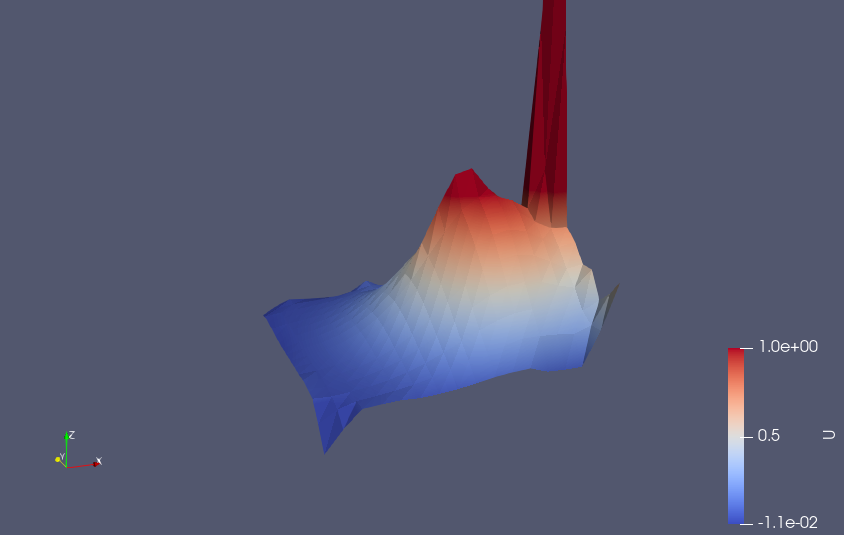
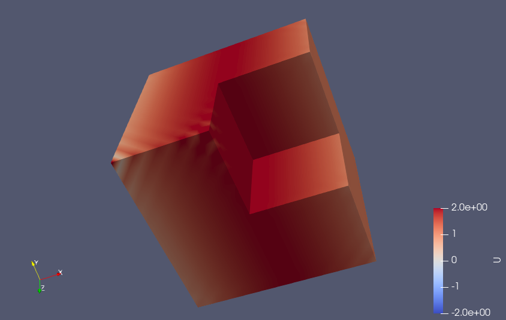

NMPDE Project
=====================================

This project is based on Step 26 of the deal.II tutorial. It has been set up to work with the *bare-dealii-app* template by prof. Luca Heltai (read below for further info).
Instead of using Rothe's method, we will use the method of lines to solve the heat equation. The boundary conditions will be imposed via Nitsche's method. For the integration in time, we will rely on the ARKode package that is part of the SUNDIALS suite. Adaptive mesh refinement will be implemented via solution transfer.

**Overview of the problem**

We consider the heat equation:

$$
    u_t(x,t) - \Delta u(x,t) = f(x,t) \quad &(x,t) \in \Omega \times (t_0,t_1]
$$

$$
    u(x,t_0) = u_0(x) \quad &x \in \Omega
$$

$$
    u(x,t) = g(x,t) \quad &(x,t) \in \partial\Omega \times [t_0,t_1]
$$

In particular, the domain $\Omega$ is a `hyper_L` (2D and 3D case) or the interval $[-1,1]$ (1D case). 
Before we start, we need to address the following issues:

- How do we discretize the PDE?

- What weak form do we choose?

To solve the PDE numerically, we use semi-discretization. In particular, there are two ways to do this:

- *Rothe's method*, i.e. discretize in time first and get a PDE which is only space-dependent; then treat the resulting problem with a finite element method. This means that the time stepping method will be pre-fixed at start.

- The *method of lines*, i.e. discretize in space first and get an ODE that depends only on time; then solve the ODE with an IVP solver.

Each way has its advantages. We choose the method of lines because Rothe's method requires us to write the time stepping by hand to get the problem that will be solved with a finite element method. This can be painful, especially when using higher order formulas or if we plan to try different time steppings. On the other hand, professional libraries for ODE solution, such as SUNDIALS, save us this effort and also implement strategies for time step adaptivity.

Regarding the weak form: a standard way to solve stationary problems is to split the solution $u$ into a sum $u_0 + u_g$, such that $u_0$ satisfies homogeneous boundary conditions and $u_g = g$ at the boundary (in terms of trace). Then we solve for $u_0 \in H^1_0(\Omega)$. We can do the same for time dependent problems, but this approach has a main disadvantage: the boundary condition $g$ changes over time. Thus, we use Nitsche's method and incorporate the boundary condition directly in the weak form.

**Weak form**

The weak form we obtain by using Nitsche's method is the following:

$$
(u_t, v) + (\nabla u, \nabla v) - \langle \nabla u \cdot n,v \rangle - \langle u, \nabla v \cdot n \rangle + \gamma \langle u,v \rangle = (f,v) - \langle g, \nabla v \cdot n \rangle + \gamma \langle g,v \rangle
$$

where $(\cdot,\cdot)$ is the inner product in $\Omega$, $\langle \cdot,\cdot \rangle$ the inner product in $\Gamma = \partial\Omega$ and $n$ is the normal to $\Gamma$. The parameter $\gamma > 0$ is fixed: we know that it has to satisfy some constraint in order for the method to work well.

Let $V_h$ be our FE space (we use Lagrange elements) and let $\phi_i$ be the basis functions. We assume that the solution can be written as $u(x,t) = \sum U_i(t) \phi_i(x)$, i.e. the degrees of freedom are time dependent. This leads to solving the following ODE:

$$
M \mathbf{u}' = f_E(t,\mathbf{u}) + f_I(t,\mathbf{u})
$$

where

$$
    \mathbf{u}_i = U_i(t)
$$

$$
    M_{ij} = (\phi_i,\phi_j)
$$

$$
    f_E(t,\mathbf{u})_i = (f(\cdot,t),\phi_i) + \gamma \langle g(\cdot,t),\phi_i \rangle - \langle g(\cdot,t),\nabla\phi_i \cdot n \rangle
$$

$$
    f_I(t,\mathbf{u}) = J \mathbf{u}
$$

$$
    J_{ij} = -(\nabla\phi_i,\nabla\phi_j) + \langle \phi_i,\nabla\phi_j \cdot n \rangle + \langle \nabla\phi_i \cdot n,\phi_j \rangle - \gamma \langle \phi_i,\phi_j \rangle
$$

In particular, it is clear that the matrices $M$ and $J$ are independent of time, therefore they need to be evaluated only one time (and re-evaluated only when the mesh is changed).

**Solving the ODE**

To determine the evolution of the degrees of freedom, we rely on the ARKode package of the SUNDIALS suite, which solves IVPs in $\mathbb{R}^n$ with a variety of variable-step, embedded, additive Runge-Kutta solvers (ARK). Generally speaking, consider the IVP

$$
    M(t) y' = f_E(t,y) + f_I(t,y), \quad t \in [t_0,T]
$$

$$
    y(t_0) = y_0
$$

where $M(t)$ is a nonsingular matrix for every $t$. In order to solve it, ARKode uses an $s$-stage additive Runge-Kutta method of the form:

$$
    z_i = y_{n-1} + h_n \sum_{j=1}^{i-1} A^E_{i,j} \hat{f}_E(t^E_{n,j}, z_j)
               + h_n \sum_{j=1}^{i} A^I_{i,j} \hat{f}_I(t^I_{n,j}, z_j),
                \quad i=1,\ldots,s,
$$

$$
    y_n = y_{n-1} + h_n \sum_{i=1}^{s} \left(b^E_i \hat{f}_E(t^E_{n,i}, z_i)
              + b^I_i \hat{f}_I(t^I_{n,i}, z_i)\right),
$$

$$
    \tilde{y}_n = y_{n-1} + h_n \sum_{i=1}^{s} \left(
               \tilde{b}^E_i \hat{f}_E(t^E_{n,i}, z_i) +
               \tilde{b}^I_i \hat{f}_I(t^I_{n,i}, z_i)\right),
$$

where we have set $\hat{f}_E(t,y) = M(t)^{-1}\,f_E(t,y)$ and $\hat{f}_I(t,y) = M(t)^{-1}\,f_I(t,y)$. In particular:

- $\tilde{y}_n$ are embedded solutions that are used for error estimation; these typically have slightly lower accuracy than the computed solutions $y_n$.

- The internal stage times of the method are $t^E_{n,j} = t_{n-1} + c^E_j h_n$ and $t^I_{n,j} = t_{n-1} + c^I_j h_n$.

- An explicit method and an implicit one are used at the same time and share the same number $s$ of stages. The coefficients from their Butcher's tables are $A^E \in \mathbb{R}^{s\times s}$, $b^E \in \mathbb{R}^s$ and $c^E \in \mathbb{R}^s$, for the explicit method, and their counterparts with the $I$, for the implicit one. Finally, the coefficients $\tilde{b}^E \in \mathbb{R}^{s}$ and $\tilde{b}^I \in \mathbb{R}^{s}$ are used to construct the embedding.

- The implicit method is diagonally implicit (DIRK).

Let us stress for a moment why we have split the right hand side into a sum of two contributions. When a system presents both fast and slow dynamics, it is important to separate them:

- $f_E$ contains the "slow" (\emph{nonstiff}) time scale components of the system. This part will be integrated using explicit methods.

- $f_I$ contains the "fast" (\emph{stiff}) time scale components of the system. This will be integrated using implicit methods.

Of course we could have treated $f_E$ as part of $f_I$ but, on the other hand, we have to try to optimize the computational effort.

When we use ARK methods, an implicit system of the form

$$
G(z_i) := M z_i - h_n A^I_{i,i} f_I(t^I_{n,i},z_i) - a_i = 0
$$

must be solved for each stage $z_i$, with $i=1,\dots,s$, where we have the data

$$
a_i := M y_{n-1} + h_n \sum_{j=1}^{i-1} \bigl[A^E_{i,j} f_E(t^E_{n,j},z_j) + A^I_{i,j} f_I(t^I_{n,j},z_j)\bigr].
$$

In our specific case, $f_I(t,y)$ will depend linearly on $y$, then this will be a linear system of equations. This will allow ARKode to take some shortcuts for a faster solution process. In particular, we choose the default solution strategy, i.e. a variant of Newton's method:

$$
z^{m+1}_i = z^m_i + \delta^{m+1},
$$

where $m$ is the Newton step index. The Newton update $\delta^{m+1}$ requires the solution of the linear Newton system

$$
N(z^m_i) \delta^{m+1} = - G(z^m_i),
$$

where

$$
N := M - \gamma J, \quad J := \frac{\partial f_I}{\partial y}, \quad
\gamma := h_n A^I_{i,i}.
$$

Since $f_I(t,y)$ depends linearly on $y$, each system will be solved using only a single Newton iteration. Moreover, to assure efficiency and robustness of the algorithm, the initial guess the method is a predicted value $z_i(0)$ that is computed explicitly from the previously-computed data (e.g. $y_{n-2}$, $y_{n-1}$ and $z_j$ for $j<i$). Additional information on the specific predictor algorithms implemented in ARKode is provided in ARKode documentation.

In conclusion, let us write again the IVP we will try to solve:

$$
    M \mathbf{u}' = f_E(t,\mathbf{u}) + f_I(t,\mathbf{u}), \quad t \in [t_0,t_1]
$$

$$
    \mathbf{u}(t_0) = \mathbf{u}_0
$$

where $\mathbf{u}_0$ is the initial condition $u_0(x)$, interpolated with respect to the basis functions $\phi_i$.

**Dealing with adaptive meshes**

Adapting the mesh is a key point for time dependent problems: the mesh has to "follow" the solution in some way and predict incoming changes in its behaviour. However, there are significant difficulties compared to the stationary case.

*Time step size and minimal mesh size*

Let us cite briefly from the Step 26 documentation. For stationary problems, the general approach is "make the mesh as fine as it is necessary". For problems with singularities, this often leads to situations where we get many levels of refinement into corners or along interfaces.

For time dependent problems, we typically have error estimates of the form

$$
\norm{e} \le O(k^p + h^q)
$$

where $p$, $q$ are the convergence orders of the time and space discretization, respectively.
We can only make the error small if we decrease both terms. Ideally, an estimate like this would suggest to choose $k\propto h^{q/p}$. Since, at least for problems with non-smooth solutions, the error is typically localized in the cells with the smallest mesh size, we have to indeed choose $k\propto h^{q/p}_{min}$, using the smallest mesh size $h_{min}$.

Having to choose the time step related to the mesh size is not a negligible issue, because using a significantly smaller time step means having to solve the global linear system more often. This implies a growth of the computational effort, typically bigger than that produced by a slight increase of the number of degrees of freedom.

In practice, having acknowledged that we can not make the time step arbitrarily small, we avoid to make the local mesh size arbitrarily small. Rather, we set a maximal level of refinement and, when we flag cells for refinement, we simply do not refine those cells whose children would exceed this maximal level of refinement. In a similar fashion, we want to be ready for a sudden refinement (e.g. when we have a source that switches on in different parts of the domain). Therefore, it is wise to enforce in our program a minimal mesh refinement level.

*Test functions from different meshes*

Let us recall the IVP we are solving:

$$
    M \mathbf{u}' = f_E(t,\mathbf{u}) + f_I(t,\mathbf{u}), \quad t \in [t_0,t_1]
$$

$$
    \mathbf{u}(t_0) = \mathbf{u}_0
$$

Suppose that at some time $t_* > t_0$ we decide to refine the mesh. This leads to a new set of basis functions $\Set{\hat{\phi}_i}$, which in turn leads to new matrices $\hat{M}$ and $\hat{J}$, plus new functions $\hat{f}_E$ and $\hat{f}_I$. Moreover, the solution, starting from $t=t_*$, will have to be expressed as a linear combinations of the new basis functions:

$$
u(x,t) \approx \sum \hat{U}_i(t) \hat{\phi}_i(x).
$$

If $\mathbf{\hat{u}}_i = \hat{U}_i$, the new IVP we have obtained is the following:

$$
    \hat{M} \mathbf{\hat{u}}' = \hat{f}_E(t,\mathbf{\hat{u}}) + \hat{f}_I(t,\mathbf{\hat{u}}), \quad t \in [t_*,t_1] 
$$

$$
	\mathbf{\hat{u}}(t_*) = \mathbf{\hat{u}}_*
$$

How do we get the vector $\mathbf{\hat{u}}_*$? In effect, we know the approximated solution at time $t_*$, but as a linear combination of the previous basis functions. Hence, we have to \emph{transfer} it to the new mesh:

$$
\mathbf{\hat{u}}_* = I_{t_*}\mathbf{u}(t_*),
$$

where $I_t$ is the interpolation operator onto the finite element space used at time $t$. Of course this approach introduces an additional error besides time and space discretization, but it is pragmatic and makes it feasible to do time adapting meshes.

*When do we refine?*

The last issue is: what kind of *a posteriori* estimate do we use to decide whether a mesh refinement is needed? In our program, we use the Kelly error estimator, which is a simplified version of the a posteriori error estimator that is used for the Poisson problem:

$$
    \eta_T := \sum_{F \subset \partial T} \frac{1}{2} h_F^{\frac{1}{2}} \norm{\jump{\nabla u_h}}_{0,F}.
$$

Here $u_h$ represents the approximated solution. We fix some checkpoints $t^{(1)}$, $t^{(2)}$, \dots $\in [t_0,t_1]$ and refine the mesh at time $t^{(k)}$ if

$$
\sum_{T \in \T_h} \eta_T^2 \le `tol`
$$

for a fixed tolerance `tol`. In particular, we leave room for doing multiple refinements at the same time. This comes in handy, for example, when there is a sudden variation in the solution. However, since the tolerance is fixed a priori, we have to be careful in order to avoid a never ending refinement loop. In fact, one may happen to choose a tolerance that is too low, and our program may not be able to adapt the mesh sufficiently (remember that we have set an inferior limit to the mesh size). Hence, we stop the refinement loop if the number of successive refinements goes beyond a certain threshold. Also we can print the $l^2$ norm of the error estimator, in order to help the user to tweak the parameters for a better approximation.

**What the program does**

The user can customize $f$, $u_0$, $g$, $t_0$ and $t_1$ via a .prm file. If also the exact solution $u$ is provided, then the program will compute the $L^2$ error for the numerical solution.

The .prm file can also be used to customize a variety of parameters for the ARKode solver, as well as $\gamma$, the finite element degree and the mesh refinement strategy.

Some examples of manufactured solution were provided in the repository for testing, along with a Jupyter Notebook \texttt{manufactured\_heat.ipynb} to help the user compute the correct $f$ automatically, given $u$.

Some key features of the program:

\begin{itemize}
    \item The assembly of matrices and vectors is done via a MeshWorker loop.
    \item Every time the parameter $\gamma$ is admissible, the linear systems involved in the IVP have a symmetric and positive definite matrix. Therefore, we use the conjugate gradient method to solve them. As a preconditioner, we use an algebraic multigrid one (AMG). This is implemented in deal.II with the TrilinosWrappers::PreconditionAMG class. In the program we also use Trilinos vectors and matrices, but this is not mandatory, as the PreconditionAMG objects support also objects from the SparseMatrix and Vector class.
    \item The program outputs the solution at fixed, customisable, timesteps. However, it can refine the grid at additional timesteps between outputs.
\end{itemize}

\section{Some tests and results}

**The problem**

We consider the heat equation $u_t(x,t) - \Delta u(x,t) = f(x,t)$, with initial condition $u_0(x)$ and boundary condition $g(x,t)$. The domain for the space variable $x$ is a `hyper_L` (2D and 3D case) or the interval $[-1,1]$ (1D case), while the time variable $t$ is in a given interval $[t_0,t_1]$. The user can customize $f$, $u_0$, $g$, $t_0$ and $t_1$ via a .prm file. If also the exact solution $u$ is provided, then the program will compute the $L^2$ error for the numerical solution. In particular, if you want to test a *manufactured solution*, you can find some examples in `other_files/test_functions.txt` or use the Jupyter Notebook `other_files/manufactured_heat.ipynb` to compute the correct $f$ automatically, given $u$.

The weak form we obtain by using Nitsche's method is the following:

$$
(u_t, v) + (\nabla u, \nabla v) - \langle \nabla u \cdot n,v \rangle - \langle u, \nabla v \cdot n \rangle + \gamma \langle u,v \rangle = (f,v) - \langle g, \nabla v \cdot n \rangle + \gamma \langle g,v \rangle
$$

where $(\cdot,\cdot)$ is the inner product in $\Omega$, $\langle \cdot,\cdot \rangle$ the inner product in $\Gamma = \partial\Omega$ and $n$ is the normal to $\Gamma$.

If $u(x,t) = \sum U_i(t) \phi_i(x)$, this leads to solving the following ODE:

$$
M \mathbf{u}' = f_E(t,\mathbf{u}) + f_I(t,\mathbf{u})
$$

where $\mathbf{u}_i=U_i(t)$, $f_I(t,\mathbf{u}) = J \mathbf{u}$ and

$$
M_{ij}=(\phi_i,\phi_j)
$$

$$
f_E(t,\mathbf{u})_i = (f(\cdot,t),\phi_i) + \gamma \langle g(\cdot,t),\phi_i \rangle - \langle g(\cdot,t),\nabla\phi_i \cdot n \rangle
$$

$$
J_{ij} = -(\nabla\phi_i,\nabla\phi_j) + \langle \phi_i,\nabla\phi_j \cdot n \rangle + \langle \nabla\phi_i \cdot n,\phi_j \rangle - \gamma \langle \phi_i,\phi_j \rangle
$$

In particular, it is clear that the matrices $M$ and $J$ are independent of time, therefore they need to be evaluated only one time (and re-evaluated only when the mesh is changed).

The .prm file can also be used to customize a variety of parameters for the ARKode solver, as well as $\gamma$, the finite element degree and the mesh refinement strategy.

**Before you start**

The program will look for the following directories to write its output and parameters:

- `output_1d`

- `output_2d`

- `output_3d`

- `parameters`

Make sure to create them in advance in the folder where you will put the executables.

Also, in the code (*at the moment, but may not be necessary*) there is a `if constexpr` statement, which requires your compiler to support at least C++17.

**Some tests without adaptive refinement - 1D case**

Some key points:

- Choosing the "right" value of `gamma` is not straightforward:

	- If it is too low, then the method becomes unstable.

	- Raising `gamma` leads to an increase of computational cost, because ARKode will use a significantly lower timestep size, hence you will have a lot more function evaluations and linear systems to be solved.

	- Choosing `gamma` too close to the minimal value that assures stability won't provide you the best accuracy (keeping the other parameters fixed). On the other hand, there's no gain in increasing it *ad libitum*, because there seems to be a trade-off value after which the accuracy lowers. Therefore, if you want maximum accuracy, you may want to reach that trade-off value as a compromise between accuracy and ARKode steps.

	- A higher mesh refinement or FE degree do require a higher value of `gamma` to maintain the stability of the method.

- Increasing the refinement of the mesh leads to a better accuracy, at the cost of more ARKode steps.

- Increasing the FE degree leads also to a better accuracy, *sometimes* with less cost in terms of ARKode steps than increasing the global mesh refinement.

- Steeper solutions may require finer meshes or higher FE degree, which makes sense.

- In order to save some computational resources, it may be useful to tweak the absolute/relative tolerance of the ARKode solver accordingly to the expected accuracy of the FE discretization (how?).

**N.B.** The following values cannot be reproduced anymore after the commit that added the dummy `solve_linearized_system` function, however the results given by the program are practically the same.

Problem 0.1

|  		  											| Error at final time | # ARKode steps | Last stepsize |
| ------------------------------------------------- |:------------------: | :------------: | :-----------: |
| Default settings    								| 0.0170169 		  | 239 		   | 0.00863937    |
| Setting `gamma` = 20    							| 0.0132823 		  | 466 		   | 0.00484964    |
| Setting `gamma` = 50    							| 0.0139199 		  | 1050 		   | 0.00105834    |
| Setting `initial_refinement` = 5, `gamma` = 10 	| explodes			  |  		   |     |
| Setting `initial_refinement` = 5, `gamma` = 20 	| 0.00312373 		  | 1691 		   | 0.000923625   |
| Setting `initial_refinement` = 5, `gamma` = 50 	| 0.000920902 		  | 2466 		   | 0.000917815   |
| Setting `initial_refinement` = 5, `gamma` = 100 	| 0.000897367 		  | 4588 		   | 0.00131488    |
| Setting `fe_degree` = 2, `gamma` = 10 			| explodes			  | 		   |     |
| Setting `fe_degree` = 2, `gamma` = 20 			| 5.68063e-06		  | 835 		   | 0.00258205    |
| Setting `fe_degree` = 2, `gamma` = 50 			| 1.38469e-05		  | 2208 		   | 0.00139237    |

Problem 0.2

|  		  											| Error at final time | # ARKode steps | Last stepsize |
| ------------------------------------------------- |:------------------: | :------------: | :-----------: |
| Default settings    								| 0.170158	 		  | 223 		   | 0.00248579    |
| Setting `initial_refinement` = 5, `gamma` = 100 	| 0.00905921 		  | 4945 		   | 0.00399241    |
| Setting `fe_degree` = 2, `gamma` = 50 			| 0.000385202		  | 1712 		   | 0.00737413    |
| Setting `fe_degree` = 2, `gamma` = 100 			| 2.36627e-05		  | 3494 		   | 0.00128724    |

Problem 1.1

|  		  											| Error at final time | # ARKode steps | Last stepsize |
| ------------------------------------------------- |:------------------: | :------------: | :-----------: |
| Default settings    								| 0.123111	 		  | 186 		   | 0.0015718     |
| Setting `initial_refinement` = 5, `gamma` = 100 	| 0.00599535 		  | 3245 		   | 0.00176189    |
| Setting `fe_degree` = 2, `gamma` = 50 			| 0.000131334		  | 1316 		   | 0.00367727    |
| Setting `fe_degree` = 2, `gamma` = 100 			| 1.33795e-05		  | 2425 		   | 0.000766395   |

**Some more tests - 2D case**

I won't go in detail with every problem, but things work fine as in the 1D case.

Problem 0.1

|  		  											| Error at final time | # ARKode steps | Last stepsize |
| ------------------------------------------------- |:------------------: | :------------: | :-----------: |
| Default settings    								| 0.00234015 		  | 2468 		   | 0.000828532   |
| Setting `initial_refinement` = 4, `gamma` = 50 	| 0.00048535 		  | 11691 		   | 0.000183677   |
| Setting `fe_degree` = 2, `gamma` = 100 			| 0.000233709 		  | 11625 		   | 0.00023591    |

Problem 0.2

|  		  											| Error at final time | # ARKode steps | Last stepsize |
| ------------------------------------------------- |:------------------: | :------------: | :-----------: |
| Default settings    								| 0.023201	 		  | 4114 		   | 0.00289068    |
| Setting `initial_refinement` = 4					| 0.00695336 		  | 9319 		   | 0.00150502    |
| Setting `initial_refinement` = 4, `gamma` = 20 	| 0.00732968 		  | 16709 		   | 0.0010305     |
| Setting `fe_degree` = 2, `gamma` = 100 			| 0.000197047 		  | 9555 		   | 0.00155699    |

Problem 2.2

|  		  											| Error at final time | # ARKode steps | Last stepsize |
| ------------------------------------------------- |:------------------: | :------------: | :-----------: |
| Default settings    								| 0.00276523 		  | 2681 		   | 0.000738375   |
| Setting `initial_refinement` = 4					| 0.000748613 		  | 3593 		   | 0.000250452   |
| Setting `initial_refinement` = 4, `gamma` = 20 	| 0.000763522 		  | 6609 		   | 0.000512176   |

The following screenshot is frame 100 with default settings:

The following one, instead, is frame 100 with `initial_refinement` = 4, `gamma` = 20:

.png)

**A (sketchy) 3D test**

The 3D case is a bit difficult to be tested, because raising the FE degree or the global refinement increases the degrees of freedom by a lot. At the moment I've studied problems 0.1 and 0.2. The solutions with default settings show some strange instability/flickering. Lowering the initial refinement to 2 seems to improve the situation, especially for problem 0.2. Is it just a matter of tweaking the parameters for better stability?

Problem 0.1, for example

|  		  											| Error at final time | # ARKode steps | Last stepsize |
| ------------------------------------------------- |:------------------: | :------------: | :-----------: |
| Default settings    								| 0.00424171 		  | 990 		   | 0.00186179    |
| Setting `initial_refinement` = 2					| 0.00827368 		  | 630 		   | 0.00262032    |

An example of flickering:

**Some (brief) 2D tests with adaptive mesh refinement**

This is a simulation of problem 2.1 with default settings, plus setting `gamma` = 20. The $L^2$ error at final time is 0.0118047.

This, instead, is a simulation of problem 2.3 with default settings, plus setting `refinement_threshold` = 0.05 and `gamma` = 20. The $L^2$ error at final time is 0.000421088.

Finally, a simulation of problem 2.4 with default settings, plus setting `refinement_threshold` = 0.1, `refinement_bottom_fraction` = 0.3 and `gamma` = 20. The $L^2$ error at final time is 0.000123987. It is interesting to compare this simulation to that of problem 2.3. In fact, when a solution tends to return to a flat state, we would like to have a coarser mesh. Hence we have to increase the refinement bottom fraction. Unfortunately, this clashes a bit with requiring the mesh to be finer when necessary, at least with the control on the parameters that we have so far.

**ToDo list**

- Provide a good PCG solver to SUNDIALS and save some computational resources.

About this template
=====================================

A bare deal.II application, with directory structure, a testsuite, and unittest
block based on google tests.

This repository can be used to bootstrap your own deal.II
application. The structure of the directory is the following:

	./source
	./include
	./tests
	./gtests
	./doc

The directories contain a minimal working application (identical to step-6, 
where implementations and declarations have been separated) to solve the
Poisson problem on a square, a test directory that uses deal.II style testing, 
a test directory that uses google tests, and a doc directory, that contains
a `Doxyfile` to use with `doxygen`.

The `CMakeLists.txt` will generate both some executables and two libraries
containing all cc files **except** `source/main.cc`, one for Debug mode and
one for Release mode. This library is linked to the running tests, so that you 
can make tests on your application just as you would do with the deal.II 
library.

Modify the TARGET variable in the CMakeLists.txt to your application
name. Two libraries named ./tests/lib${TARGET}.so and ./tests/lib${TARGET}.g.so
will be generated together with one executable per dimension, per build type,
i.e., a total of six executables, and two libraries.

After you have compiled your application, you can run 

	make test

or
	
	ctest 

to start the testsuite.

Take a look at
https://www.dealii.org/developer/developers/testsuite.html for more
information on how to create tests and add categories of tests, and a look at
https://github.com/google/googletest/blob/master/googletest/docs/primer.md
for a quick setup of unit tests with google test.

Both `.travis.yml` and `.gitlab-ci.yml` files are provided that 
build the application and run the tests in the tests directory using
ctest, in continuous integration, by running under docker with the 
image provided on dockerhub.com: `dealii/dealii:master-focal`.

Moreover, three github actions are provided to check indentation, build
the documentation, and test the library from within github actions.

The documentation is built and deployed at each merge to master. You can 
find the latest documentation here:
https://luca-heltai.github.io/bare-dealii-app/

Licence
=======

See the file ./LICENSE for details
