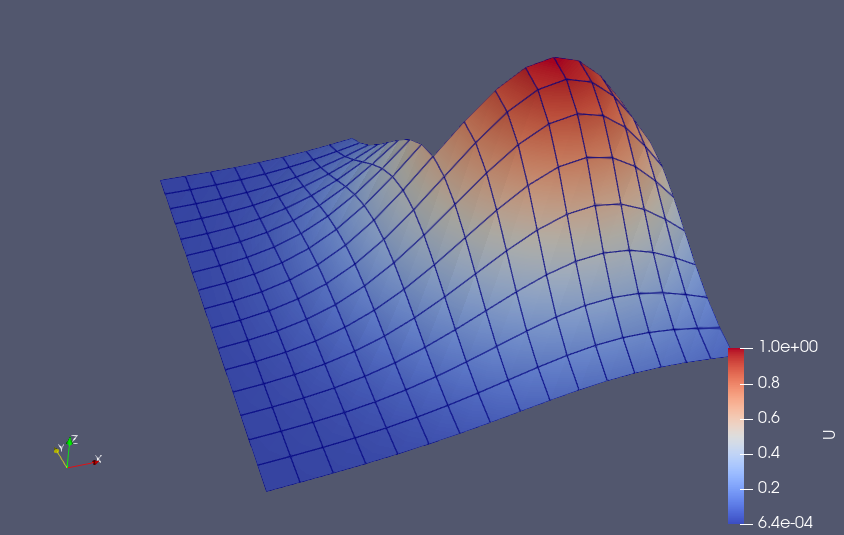
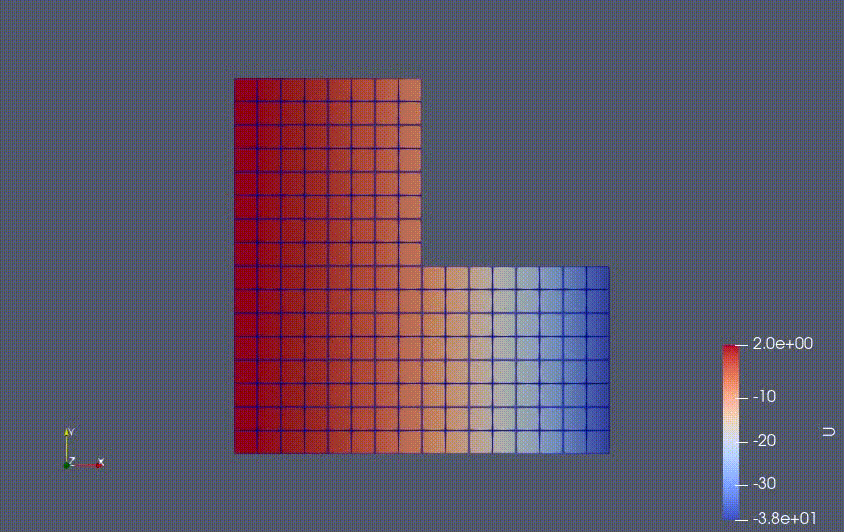
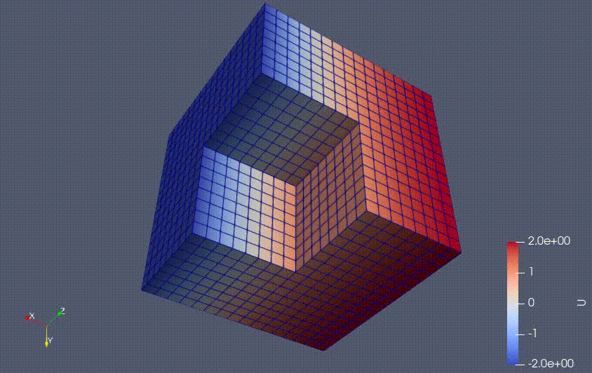
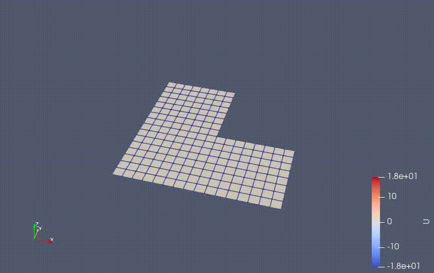
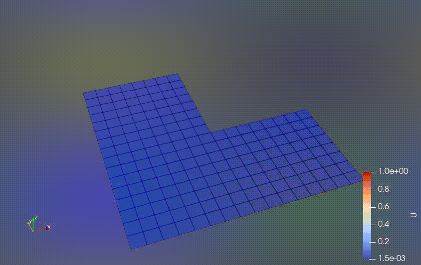

NMPDE Project
=====================================

This project is based on Step 26 of the deal.II tutorial. It has been set up to work with the *bare-dealii-app* template by prof. Luca Heltai (read below for further info).
Instead of using Rothe's method, we will use the method of lines to solve the heat equation. The boundary conditions will be imposed via Nitsche's method. For the integration in time, we will rely on the ARKode package that is part of the SUNDIALS suite. Adaptive mesh refinement will be implemented via solution transfer.

**Overview of the problem**

We consider the heat equation $u_t(x,t) - \Delta u(x,t) = f(x,t)$, with initial condition $u_0(x)$ and boundary condition $g(x,t)$. The domain $\Omega$ for the space variable $x$ is a `hyper_L` (2D and 3D case) or the interval $[-1,1]$ (1D case), while the time variable $t$ is in a given interval $[t_0,t_1]$.

The weak form we obtain by using Nitsche's method is the following:

$$
(u_t, v) + (\nabla u, \nabla v) - \langle \nabla u \cdot n,v \rangle - \langle u, \nabla v \cdot n \rangle + \gamma \langle u,v \rangle = (f,v) - \langle g, \nabla v \cdot n \rangle + \gamma \langle g,v \rangle
$$

where $(\cdot,\cdot)$ is the inner product in $\Omega$, $\langle \cdot,\cdot \rangle$ the inner product in $\Gamma = \partial\Omega$ and $n$ is the normal to~$\Gamma$. The parameter $\gamma > 0$ is fixed.

Let $V_h$ be our FE space (we use Lagrange elements) and let $\phi_i$ be the basis functions. We assume that the numerical solution $u_h \in V_h$ can be written as $u_h(x,t) = \sum U_i(t) \phi_i(x)$, i.e. the degrees of freedom are time dependent. This leads to solving the following ODE:

$$
M \mathbf{u}' = f_E(t,\mathbf{u}) + f_I(t,\mathbf{u})
$$

where $\mathbf{u}_i=U_i(t)$, $f_I(t,\mathbf{u}) = J \mathbf{u}$ and

$$
M_{ij}=(\phi_i,\phi_j)
$$

$$
f_E(t,\mathbf{u})_i = (f(\cdot,t),\phi_i) + \gamma \langle g(\cdot,t),\phi_i \rangle - \langle g(\cdot,t),\nabla\phi_i \cdot n \rangle
$$

$$
J_{ij} = -(\nabla\phi_i,\nabla\phi_j) + \langle \phi_i,\nabla\phi_j \cdot n \rangle + \langle \nabla\phi_i \cdot n,\phi_j \rangle - \gamma \langle \phi_i,\phi_j \rangle
$$

In particular, it is clear that the matrices $M$ and $J$ are independent of time, therefore they need to be evaluated only one time (and re-evaluated only when the mesh is changed).

For more details on how the problem is treated, please refer to the documentation in the file `help_files/documentation.pdf`.

**Before you start**

For each dimension $d=1,2,3$ the program will be built in two versions: a debug mode (.g) and a release mode. The program will look for the following directories to write its output and parameters:

- `output_1d`

- `output_2d`

- `output_3d`

- `parameters`

Make sure to create them in advance in the folder where you will put the executables.

Also, in the code there is a `if constexpr` statement, which requires your compiler to support at least C++17.

At first use, a .prm file will be written in the directory `parameters`. This contains all the customizable parameters for the problem. In particular, you can change $f$, $u_0$, $g$, $t_0$ and $t_1$, along with $\gamma$, a variety of parameters for the ARKode solver, the finite element degree and the mesh refinement strategy.

If you want to test a manufactured solution, you can provide the exact solution $u$ in the .prm file: in that case, the program will compute the $L^2$ error for the numerical solution. Some examples of manufactured solution are provided in `help_files/test_functions.txt`, along with a Jupyter Notebook `help_files/manufactured_heat.ipynb` to help you compute the correct $f$ automatically, given $u$.

**Gallery - 2D case with no adaptive mesh refinement**

The following screenshot is frame 100 of Problem 2.2 with default settings:

The following one, instead, is frame 100 with `initial_refinement` = 4, `gamma` = 20:

.png)

An animation of Problem 0.2 with `fe_degree` = 2, `gamma` = 20:

**Gallery - 3D case with no adaptive mesh refinement**

An example of "solution flickering" on Problem 0.1 with the pre-Trilinos version:

An animation of Problem 0.1 with the actual version, with default settings, plus `gamma` = 100. Here we have no flickering:

**Gallery - 2D case with adaptive mesh refinement**

This is a simulation of problem 2.1 with default settings, plus setting `gamma` = 20. The $L^2$ error at final time is 0.011892, after 5058 ARKode steps.

This, instead, is a simulation of problem 2.3 with default settings, plus setting `refinement_threshold` = 0.05 and `gamma` = 20. The $L^2$ error at final time is 0.000411499, after 4624 ARKode steps.

Finally, a simulation of problem 2.4 with default settings, plus setting `refinement_threshold` = 0.1, `refinement_bottom_fraction` = 0.3 and `gamma` = 20. The $L^2$ error at final time is 0.000147814, after 4758 ARKode steps. It is interesting to compare this simulation to that of problem 2.3. In fact, when a solution tends to return to a flat state, we would like to have a coarser mesh. Hence we have to increase the refinement bottom fraction. Unfortunately, this clashes a bit with requiring the mesh to be finer when necessary, at least with the control on the parameters that we have so far.

.gif)

About this template
=====================================

A bare deal.II application, with directory structure, a testsuite, and unittest
block based on google tests.

This repository can be used to bootstrap your own deal.II
application. The structure of the directory is the following:

	./source
	./include
	./tests
	./gtests
	./doc

The directories contain a minimal working application (identical to step-6, 
where implementations and declarations have been separated) to solve the
Poisson problem on a square, a test directory that uses deal.II style testing, 
a test directory that uses google tests, and a doc directory, that contains
a `Doxyfile` to use with `doxygen`.

The `CMakeLists.txt` will generate both some executables and two libraries
containing all cc files **except** `source/main.cc`, one for Debug mode and
one for Release mode. This library is linked to the running tests, so that you 
can make tests on your application just as you would do with the deal.II 
library.

Modify the TARGET variable in the CMakeLists.txt to your application
name. Two libraries named ./tests/lib${TARGET}.so and ./tests/lib${TARGET}.g.so
will be generated together with one executable per dimension, per build type,
i.e., a total of six executables, and two libraries.

After you have compiled your application, you can run 

	make test

or
	
	ctest 

to start the testsuite.

Take a look at
https://www.dealii.org/developer/developers/testsuite.html for more
information on how to create tests and add categories of tests, and a look at
https://github.com/google/googletest/blob/master/googletest/docs/primer.md
for a quick setup of unit tests with google test.

Both `.travis.yml` and `.gitlab-ci.yml` files are provided that 
build the application and run the tests in the tests directory using
ctest, in continuous integration, by running under docker with the 
image provided on dockerhub.com: `dealii/dealii:master-focal`.

Moreover, three github actions are provided to check indentation, build
the documentation, and test the library from within github actions.

The documentation is built and deployed at each merge to master. You can 
find the latest documentation here:
https://luca-heltai.github.io/bare-dealii-app/

Licence
=======

See the file ./LICENSE for details
