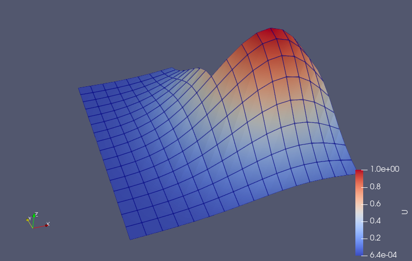

NMPDE Project
=====================================

This project is based on Step 26 of the deal.II tutorial. It has been set up to work with the *bare-dealii-app* template by Luca Heltai (read below for further info).
Instead of using Rothe's method, we will use the method of lines to solve the heat equation. The boundary conditions will be imposed via Nitsche's method. For the integration in time, we will rely on the ARKode package that is part of the SUNDIALS suite. Adaptive mesh refinement will be implemented via solution transfer.

**The problem**

We consider the heat equation $u_t(x,t) - \Delta u(x,t) = f(x,t)$, with initial condition $u_0(x)$ and boundary condition $g(x,t)$. The domain for the space variable $x$ is a `hyper_L` (2D and 3D case) or the interval $[-1,1]$ (1D case), while the time variable $t$ is in a given interval $[t_0,t_1]$. The user can customize $f$, $u_0$, $g$, $t_0$ and $t_1$ via a .prm file. If also the exact solution $u$ is provided, then the program will compute the $L^2$ error for the numerical solution. In particular, if you want to test a *manufactured solution*, you can find some examples in `other_files/test_functions.txt` or use the Jupyter Notebook `other_files/manufactured_heat.ipynb` to compute the correct $f$ automatically, given $u$.

The weak form we obtain by using Nitsche's method is the following:

$$
(u_t, v) + (\nabla u, \nabla v) - \langle \nabla u \cdot n,v \rangle - \langle u, \nabla v \cdot n \rangle + \gamma \langle u,v \rangle = (f,v) - \langle g, \nabla v \cdot n \rangle + \gamma \langle g,v \rangle
$$

where $(\cdot,\cdot)$ is the inner product in $\Omega$, $\langle \cdot,\cdot \rangle$ the inner product in $\Gamma = \partial\Omega$ and $n$ is the normal to $\Gamma$.

If $u(x,t) = \sum U_i(t) \phi_i(x)$, this leads to solving the following ODE:

$$
M \mathbf{u}' = f_E(t,\mathbf{u}) + f_I(t,\mathbf{u})
$$

where $\mathbf{u}_i=U_i(t)$, $f_I(t,\mathbf{u}) = J \mathbf{u}$ and

$$
M_{ij}=(\phi_i,\phi_j)
$$

$$
f_E(t,\mathbf{u})_i = (f(\cdot,t),\phi_i) + \gamma \langle g(\cdot,t),\phi_i \rangle - \langle g(\cdot,t),\nabla\phi_i \cdot n \rangle
$$

$$
J_{ij} = -(\nabla\phi_i,\nabla\phi_j) + \langle \phi_i,\nabla\phi_j \cdot n \rangle + \langle \nabla\phi_i \cdot n,\phi_j \rangle - \gamma \langle \phi_i,\phi_j \rangle
$$

In particular, it is clear that the matrices $M$ and $J$ are independent of time, therefore they need to be evaluated only one time (and re-evaluated only when the mesh is changed).

The .prm file can also be used to customize a variety of parameters for the ARKode solver, as well as $\gamma$, the finite element degree and the mesh refinement strategy.

**Before you start**

The program will look for the following directories to write its output and parameters:

- `output_1d`

- `output_2d`

- `output_3d`

- `parameters`

Make sure to create them in advance in the folder where you will put the executables.

Also, in the code (*at the moment, but may not be necessary*) there is a `if constexpr` statement, which requires your compiler to support at least C++17.

**Some tests without adaptive refinement - 1D case**

Some key points:

- Choosing the "right" value of `gamma` is not straightforward:

	- If it is too low, then the method becomes unstable.

	- Raising `gamma` leads to an increase of computational cost, because ARKode will use a significantly lower timestep size, hence you will have a lot more function evaluations and linear systems to be solved.

	- Choosing `gamma` too close to the minimal value that assures stability won't provide you the best accuracy (keeping the other parameters fixed). On the other hand, there's no gain in increasing it *ad libitum*, because there seems to be a trade-off value after which the accuracy lowers. Therefore, if you want maximum accuracy, you may want to reach that trade-off value as a compromise between accuracy and ARKode steps.

	- A higher mesh refinement or FE degree do require a higher value of `gamma` to maintain the stability of the method.

- Increasing the refinement of the mesh leads to a better accuracy, at the cost of more ARKode steps.

- Increasing the FE degree leads also to a better accuracy, *sometimes* with less cost in terms of ARKode steps than increasing the global mesh refinement.

- Steeper solutions may require finer meshes or higher FE degree, which makes sense.

- In order to save some computational resources, it may be useful to tweak the absolute/relative tolerance of the ARKode solver accordingly to the expected accuracy of the FE discretization (how?).

**N.B.** The following values cannot be reproduced anymore after the commit that added the dummy `solve_linearized_system` function, however the results given by the program are practically the same.

Problem 0.1

|  		  											| Error at final time | # ARKode steps | Last stepsize |
| ------------------------------------------------- |:------------------: | :------------: | :-----------: |
| Default settings    								| 0.0170169 		  | 239 		   | 0.00863937    |
| Setting `gamma` = 20    							| 0.0132823 		  | 466 		   | 0.00484964    |
| Setting `gamma` = 50    							| 0.0139199 		  | 1050 		   | 0.00105834    |
| Setting `initial_refinement` = 5, `gamma` = 10 	| explodes			  |  		   |     |
| Setting `initial_refinement` = 5, `gamma` = 20 	| 0.00312373 		  | 1691 		   | 0.000923625   |
| Setting `initial_refinement` = 5, `gamma` = 50 	| 0.000920902 		  | 2466 		   | 0.000917815   |
| Setting `initial_refinement` = 5, `gamma` = 100 	| 0.000897367 		  | 4588 		   | 0.00131488    |
| Setting `fe_degree` = 2, `gamma` = 10 			| explodes			  | 		   |     |
| Setting `fe_degree` = 2, `gamma` = 20 			| 5.68063e-06		  | 835 		   | 0.00258205    |
| Setting `fe_degree` = 2, `gamma` = 50 			| 1.38469e-05		  | 2208 		   | 0.00139237    |

Problem 0.2

|  		  											| Error at final time | # ARKode steps | Last stepsize |
| ------------------------------------------------- |:------------------: | :------------: | :-----------: |
| Default settings    								| 0.170158	 		  | 223 		   | 0.00248579    |
| Setting `initial_refinement` = 5, `gamma` = 100 	| 0.00905921 		  | 4945 		   | 0.00399241    |
| Setting `fe_degree` = 2, `gamma` = 50 			| 0.000385202		  | 1712 		   | 0.00737413    |
| Setting `fe_degree` = 2, `gamma` = 100 			| 2.36627e-05		  | 3494 		   | 0.00128724    |

Problem 1.1

|  		  											| Error at final time | # ARKode steps | Last stepsize |
| ------------------------------------------------- |:------------------: | :------------: | :-----------: |
| Default settings    								| 0.123111	 		  | 186 		   | 0.0015718     |
| Setting `initial_refinement` = 5, `gamma` = 100 	| 0.00599535 		  | 3245 		   | 0.00176189    |
| Setting `fe_degree` = 2, `gamma` = 50 			| 0.000131334		  | 1316 		   | 0.00367727    |
| Setting `fe_degree` = 2, `gamma` = 100 			| 1.33795e-05		  | 2425 		   | 0.000766395   |

**Some more tests - 2D case**

I won't go in detail with every problem, but things work fine as in the 1D case.

Problem 0.1

|  		  											| Error at final time | # ARKode steps | Last stepsize |
| ------------------------------------------------- |:------------------: | :------------: | :-----------: |
| Default settings    								| 0.00234015 		  | 2468 		   | 0.000828532   |
| Setting `initial_refinement` = 4, `gamma` = 50 	| 0.00048535 		  | 11691 		   | 0.000183677   |
| Setting `fe_degree` = 2, `gamma` = 100 			| 0.000233709 		  | 11625 		   | 0.00023591    |

Problem 0.2

|  		  											| Error at final time | # ARKode steps | Last stepsize |
| ------------------------------------------------- |:------------------: | :------------: | :-----------: |
| Default settings    								| 0.023201	 		  | 4114 		   | 0.00289068    |
| Setting `initial_refinement` = 4					| 0.00695336 		  | 9319 		   | 0.00150502    |
| Setting `initial_refinement` = 4, `gamma` = 20 	| 0.00732968 		  | 16709 		   | 0.0010305     |
| Setting `fe_degree` = 2, `gamma` = 100 			| 0.000197047 		  | 9555 		   | 0.00155699    |

Problem 2.2

|  		  											| Error at final time | # ARKode steps | Last stepsize |
| ------------------------------------------------- |:------------------: | :------------: | :-----------: |
| Default settings    								| 0.00276523 		  | 2681 		   | 0.000738375   |
| Setting `initial_refinement` = 4					| 0.000748613 		  | 3593 		   | 0.000250452   |
| Setting `initial_refinement` = 4, `gamma` = 20 	| 0.000763522 		  | 6609 		   | 0.000512176   |

The following screenshot is frame 100 with default settings:

The following one, instead, is frame 100 with `initial_refinement` = 4, `gamma` = 20:

.png)

**A (sketchy) 3D test**

The 3D case is a bit difficult to be tested, because raising the FE degree or the global refinement increases the degrees of freedom by a lot. At the moment I've studied problems 0.1 and 0.2. The solutions with default settings show some strange instability/flickering. Lowering the initial refinement to 2 seems to improve the situation, especially for problem 0.2. Is it just a matter of tweaking the parameters for better stability?

Problem 0.1, for example

|  		  											| Error at final time | # ARKode steps | Last stepsize |
| ------------------------------------------------- |:------------------: | :------------: | :-----------: |
| Default settings    								| 0.00424171 		  | 990 		   | 0.00186179    |
| Setting `initial_refinement` = 2					| 0.00827368 		  | 630 		   | 0.00262032    |

An example of flickering:

**Some (brief) 2D tests with adaptive mesh refinement**

This is a simulation of problem 2.1 with default settings, plus changing `gamma` = 20. The $L^2$ error at final time is 0.0118047.

This, instead, is a simulation of problem 2.3 with default settings, plus changing `refinement_threshold` = 0.05 and `gamma` = 20. The $L^2$ error at final time is 0.000421088.

**ToDo list**

- Provide a good PCG solver to SUNDIALS and save some computational resources.

About this template
=====================================

A bare deal.II application, with directory structure, a testsuite, and unittest
block based on google tests.

This repository can be used to bootstrap your own deal.II
application. The structure of the directory is the following:

	./source
	./include
	./tests
	./gtests
	./doc

The directories contain a minimal working application (identical to step-6, 
where implementations and declarations have been separated) to solve the
Poisson problem on a square, a test directory that uses deal.II style testing, 
a test directory that uses google tests, and a doc directory, that contains
a `Doxyfile` to use with `doxygen`.

The `CMakeLists.txt` will generate both some executables and two libraries
containing all cc files **except** `source/main.cc`, one for Debug mode and
one for Release mode. This library is linked to the running tests, so that you 
can make tests on your application just as you would do with the deal.II 
library.

Modify the TARGET variable in the CMakeLists.txt to your application
name. Two libraries named ./tests/lib${TARGET}.so and ./tests/lib${TARGET}.g.so
will be generated together with one executable per dimension, per build type,
i.e., a total of six executables, and two libraries.

After you have compiled your application, you can run 

	make test

or
	
	ctest 

to start the testsuite.

Take a look at
https://www.dealii.org/developer/developers/testsuite.html for more
information on how to create tests and add categories of tests, and a look at
https://github.com/google/googletest/blob/master/googletest/docs/primer.md
for a quick setup of unit tests with google test.

Both `.travis.yml` and `.gitlab-ci.yml` files are provided that 
build the application and run the tests in the tests directory using
ctest, in continuous integration, by running under docker with the 
image provided on dockerhub.com: `dealii/dealii:master-focal`.

Moreover, three github actions are provided to check indentation, build
the documentation, and test the library from within github actions.

The documentation is built and deployed at each merge to master. You can 
find the latest documentation here:
https://luca-heltai.github.io/bare-dealii-app/

Licence
=======

See the file ./LICENSE for details
